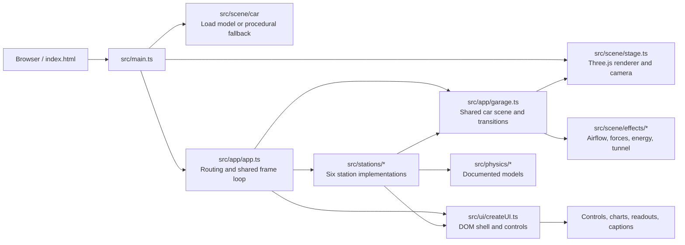
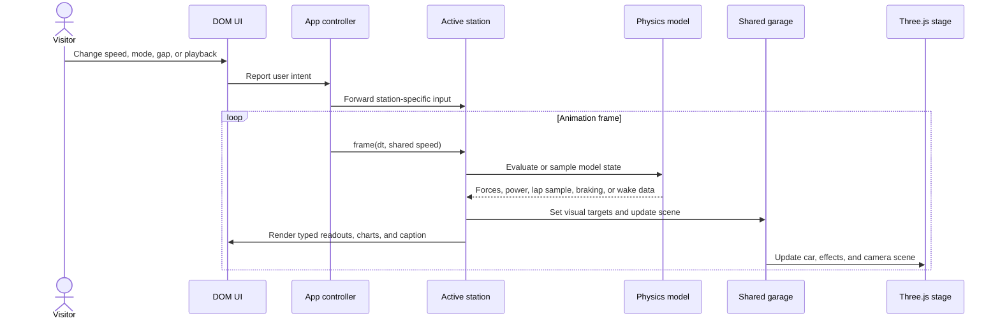

# UNSEEN — the 2026 grand-prix car, opened up

UNSEEN is an interactive 3D explainer of a representative 2026 Formula 1™ car. Explore six **stations**, each built around a control and a physical idea: change the input, watch the car and its live readouts respond, then see a concise explanation of why.

## Explore the car

| # | Station | Main control | What it reveals |
|---|---------|--------------|-----------------|
| 01 | **Downforce** | Speed | Downforce and drag grow with speed; compare the front wing, floor, and rear wing, expose the floor with the exploded-car view, or flip the rig for a ceiling test that compares downforce with weight. |
| 02 | **Active aero** | Speed and Corner / Straight Mode | Switch the wings between Corner Mode and Straight Mode, compare drag and downforce, and see estimated power demand and top speed. The model reflects the 2026 mode switch rather than DRS. |
| 03 | **Energy** | Scrubbable lap timeline | Follow a simulated lap to see battery charge, motor deployment, braking recovery, and super clipping. X-ray the car to reveal the power unit and animate energy paths; turn clipping or airflow on and off. |
| 04 | **Braking** | Entry speed and Brake | Play or scrub a braking zone and inspect deceleration, forward load transfer, exaggerated suspension dive, glowing brake discs, regenerative harvest, and heat. Toggle see-through wheels to reveal the brakes. |
| 05 | **Tow** | Following-car gap | Compare leading and following-car drag and downforce in an illustrative wake model, including saved power and the grip tradeoff. |
| 06 | **Aero map** | Speed and static ride heights | The tool aerodynamicists use for a ground-effect car: downforce, drag and balance charted against front and rear ride height. Set the ride heights (sliders, presets or drag the set-up on the map), add speed and watch the car squat across the map, the floor's suction grow and the balance move — until, run too low, the diffuser stalls and the car porpoises. Includes the pressure under the floor. |

All stations include live readouts and explanatory captions. Speed-based stations provide speed presets and an animated speed sweep; the energy and braking stations have timeline playback, scrubbing, and playback-rate controls. The shared interface also includes station tabs, camera reset, engine sound, light/dark themes, an optional paint scheme (clay by default; unofficial Mersedez, Red Bul, Ferarri and McLaran colour interpretations; press `L` to cycle), and a **How it works** reference. Keyboard shortcuts are shown in the interface.

Regulation facts cite the FIA 2026 Technical Regulations (Section C, Issue 20). Unpublished quantities such as aero coefficients, grip, and brake behavior are model assumptions and are identified as **estimates** in the app. The tow wake is illustrative, not CFD. The aero map is a physics-shaped estimate, not a team's data: its shapes come from published moving-ground wind-tunnel tests (Zerihan 2001 for a wing in ground effect, Ruhrmann & Zhang 2003 for a diffuser), set into the 2026 floor and plank geometry and calibrated to the app's ClA and balance; its porpoising is an illustration of the mechanism. See `src/physics/constants.ts` and `src/physics/aeromap.ts` for values and sources.

## Run it

Requires Node 22.12+.

```bash
npm install
npm run dev        # http://localhost:5173
npm test           # physics and station unit tests (Vitest)
npm run typecheck  # TypeScript check
npm run build      # type-check + static production build into dist/
npm run preview    # serve the production build locally
```

The app requires WebGL 2. If the processed car model cannot load, startup falls back to a procedural car so the explainer can still run. The site is fully static; see [docs/DEPLOY.md](docs/DEPLOY.md) for Cloudflare Pages and GitHub Pages hosting.

## Visits

The page keeps a cookieless count of how people arrive and what they open: referrer host or campaign tag, phone / tablet / desktop, browser family, and the stations reached. Nothing identifies a person — no cookie, account, IP address, or raw user-agent. Automated browsers (screenshots, Lighthouse) are skipped.

`npm run dev` and `npm run preview` collect into that process. Open [http://localhost:5173/api/stats](http://localhost:5173/api/stats) (add `?format=json` for the same numbers as JSON). On Cloudflare Pages the same routes are `functions/api/collect.ts` and `functions/api/stats.ts`; bind a KV namespace named `ANALYTICS` or the counts last only as long as the server process. GitHub Pages serves the static files and does not run those routes. Rows are kept for 90 days and the report shows the last 30.

## Architecture

The app is organized around a persistent 3D stage and garage. The app shell creates each station once, routes between stations by hash, and keeps shared state such as speed. A station owns the active experience: it combines physics results with garage commands and sends a typed view to the DOM UI.



### Frame and data flow



Station routes are hash-based: `#/downforce`, `#/active-aero`, `#/energy`, `#/braking`, `#/tow`, and `#/aero-map`.

### Project layout

| Path | Responsibility |
|------|----------------|
| `src/main.ts` | WebGL 2 check, stage/model startup, fallback handling, and the visit beacon. |
| `src/analytics/` | Cookieless visit records, the `/api/stats` rollup, and the dev-server routes. |
| `functions/api/` | Cloudflare Pages handlers for `/api/collect` and `/api/stats`. |
| `src/app/` | Station routing, shared speed and animation loop, garage scene, and engine sound (a recorded engine played by position, `src/app/sound/`). |
| `src/stations/` | Station-specific configuration, interaction, captions, and view models. |
| `src/physics/` | Aero, powertrain, track/lap, braking, tow and aero-map (ride height, platform, porpoising) models; constants and sources; focused Vitest tests. |
| `src/scene/` | Three.js stage, car assembly/materials, motion, and visual effects. |
| `src/ui/` | Responsive DOM interface, station controls, readouts, charts, track map, captions, and reference dialog. |
| `models/` and `public/models/` | Original model source and processed runtime asset. |
| `scripts/model/` | Model inspection, processing, and geometry pipeline. |
| `scripts/shot.mjs` | Headless browser screenshots for visual checks. |
| `dev/` | Standalone development harnesses for individual visual and physics systems. |

The UI is plain TypeScript and DOM; there is no UI framework. Vite builds the static app, Three.js renders the car and effects, and `camera-controls` handles camera interaction. Physics models are separate from rendering, and their tests run with Vitest.

## Model and validation

The checked-in runtime model is the processed GLB in `public/models/`; the larger original source is kept separately under `models/source/`. `npm run model` runs the model processing pipeline and may require substantial memory. `npm run shot` captures browser screenshots for visual checks. `npm run livery:shots` photographs each paint scheme in the running app (explode, X-ray and ceiling states too); `npm run verify:clay` proves choosing Clay restores the studio finish exactly; `npm run audio:render` renders the car sound offline through the real engine module; and `npm run verify:sound` (after `npm run build`) checks the built app's sound under the production CSP: silent until turned on, no oscillators, mute really mutes. The static production output is `dist/`.

## Credits

- Car body model: "F1 2026 concept (polygon model)"
  (https://sketchfab.com/3d-models/f1-2026-concept-polygon-model-ea3bde709b1e4dc9b0ec8557d106ed42) by Qvist_designs
  (https://sketchfab.com/Qvist_Designs), licensed under CC-BY-4.0 (http://creativecommons.org/licenses/by/4.0/).
  Modified: re-meshed, split into parts, decimated, materials replaced.
- Engine sound: "Import car revs on Chassis Dyno with Turbo.wav" by editboy23 on Freesound
  (https://freesound.org/people/editboy23/sounds/496171/), CC0 1.0 (https://creativecommons.org/publicdomain/zero/1.0/).
  A turbocharged Toyota Supra on a chassis dyno; trimmed, stored as FLAC and played back by position in the recording (never
  pitched). Credit and a description of the processing sit beside the audio in `src/app/sound/samples/CREDITS.txt`.
- Fonts: Archivo, IBM Plex Sans Condensed, IBM Plex Mono (SIL Open Font License) via Fontsource.
- three.js and camera-controls (MIT).

## Licence

Code: GNU GPL v3 (see [LICENSE](LICENSE)). The 3D model keeps its own CC BY 4.0 licence; the engine recording is CC0.

## Disclaimer

UNSEEN is an independent fan project. It is unofficial and is not affiliated with, endorsed by or associated in any way with the Formula 1
companies, the FIA or any team. F1, FORMULA ONE, FORMULA 1, FIA FORMULA ONE WORLD CHAMPIONSHIP, GRAND PRIX and related marks are
trade marks of Formula One Licensing B.V. The car body is a concept model, not any team's car. The optional paint schemes are unofficial
colour interpretations of the 2026 Mersedez, Red Bul, Ferarri and McLaran cars (colour, fade and simple shapes only; no crests,
wordmarks or sponsor marks). Team names appear only to say which colours are meant and belong to their owners.
